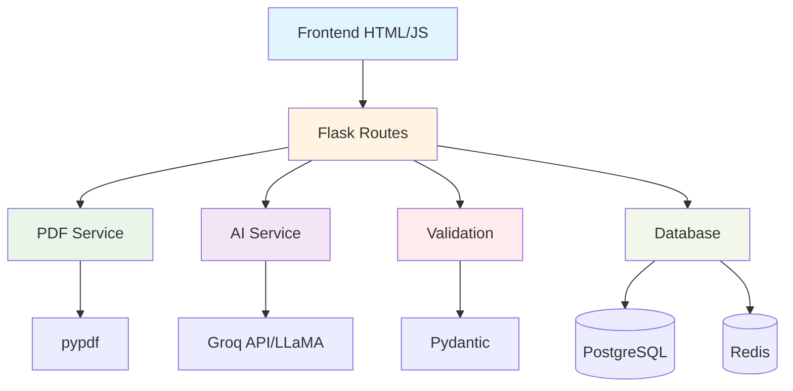
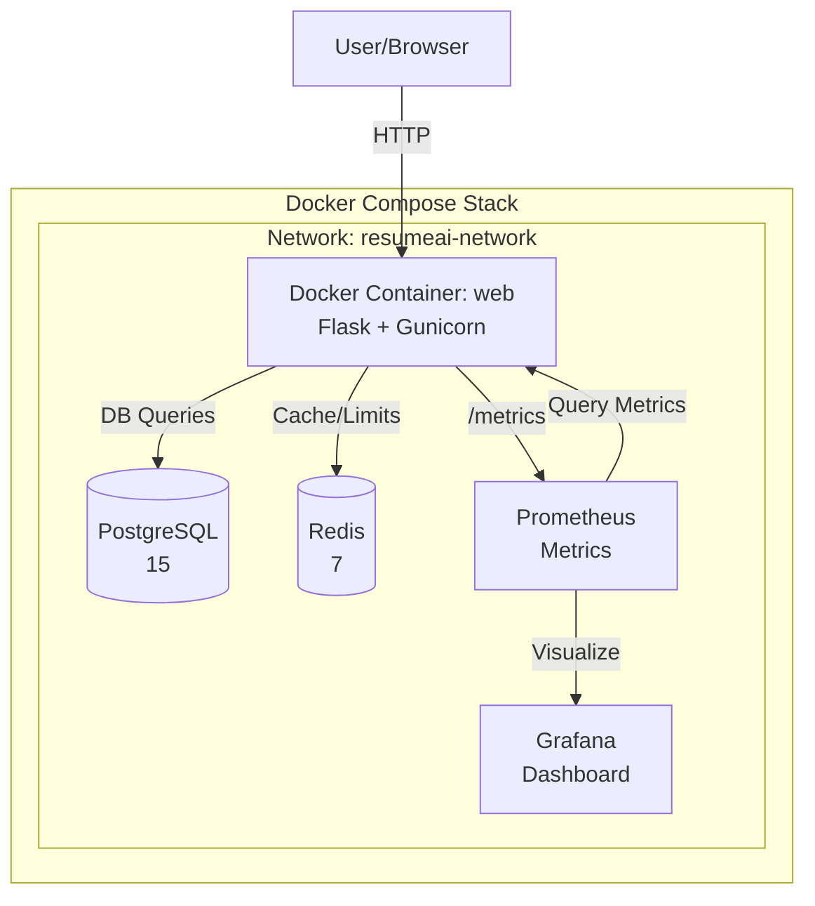
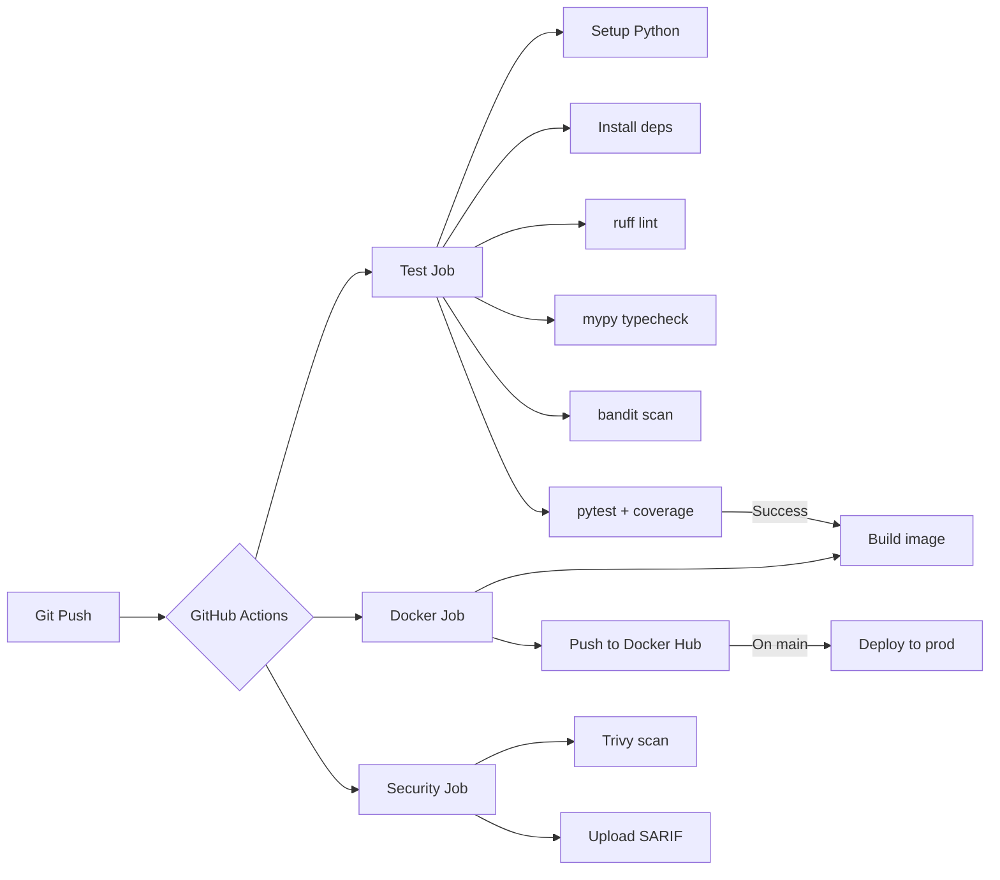

# Dependencies Visualization

```mermaid
graph TD
    A[Frontend HTML/JS] --> B[Flask Routes]
    B --> C[PDF Service]
    B --> D[AI Service]
    B --> E[Validation]
    B --> F[Database]
    C --> G[pypdf]
    D --> H[Groq API/LLaMA]
    E --> I[Pydantic]
    F --> J[(PostgreSQL)]
    F --> K[(Redis)]
    
    style A fill:#e1f5ff
    style B fill:#fff4e1
    style C fill:#e8f5e9
    style D fill:#f3e5f5
    style E fill:#ffebee
    style F fill:#f1f8e9
```

# Deployment Architecture

```mermaid
graph TB
    subgraph "Docker Compose Stack"
        subgraph "Network: resumeai-network"
            web[Docker Container: web<br/>Flask + Gunicorn]
            pg[(PostgreSQL<br/>15)]
            rd[(Redis<br/>7)]
            pm[Prometheus<br/>Metrics]
            gf[Grafana<br/>Dashboard]
        end
        
        web -->|DB Queries| pg
        web -->|Cache/Limits| rd
        web -->|/metrics| pm
        pm -->|Query Metrics| web
        pm -->|Visualize| gf
    end
    
    user[User/Browser] -->|HTTP| web
```

# CI/CD Pipeline Flow

```mermaid
graph LR
    A[Git Push] --> B{GitHub Actions}
    B --> C[Test Job]
    B --> D[Docker Job]
    B --> E[Security Job]
    
    C --> C1[Setup Python]
    C --> C2[Install deps]
    C --> C3[ruff lint]
    C --> C4[mypy typecheck]
    C --> C5[bandit scan]
    C --> C6[pytest + coverage]
    
    D --> D1[Build image]
    D --> D2[Push to Docker Hub]
    
    E --> E1[Trivy scan]
    E --> E2[Upload SARIF]
    
    C6 -->|Success| D1
    D2 -->|On main| F[Deploy to prod]
```